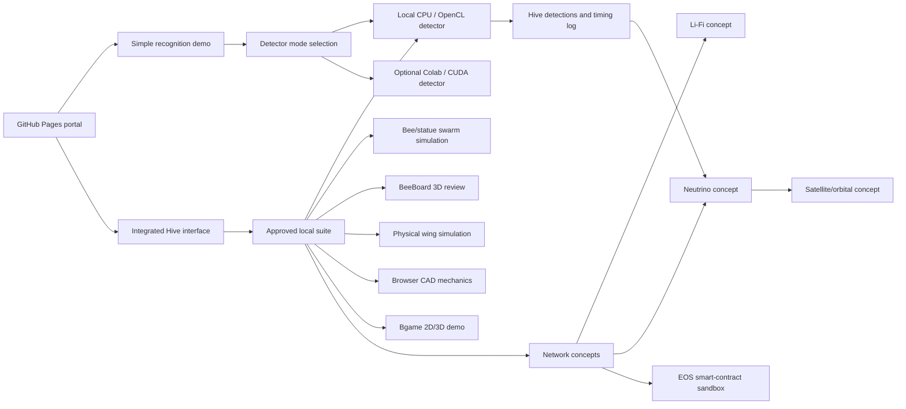

# Bee Face Recognition Project


Bee Face Recognition Project is an AI-assisted engineering prototype by **Yaroslav Kholodinin**, a student at **Shenkar College, Israel**.

The project combines a local face-recognition pipeline, an AI MIPS Hive interface, bee / board / mechanics simulations, partial SystemVerilog AI MIPS hardware sources, and several research-concept modules for future swarm communication.

It is not a commercial production service. It is a portfolio and course-style system integration project: the value is in connecting neural inference, GPU/CPU execution, local simulation tools, hardware-oriented MIPS work, browser UI, installers, and a safer browser-to-local-app bridge into one demonstrable environment.

## Live Links

- GitHub Pages portal:  
  https://holodininyaroslav.github.io/bee-face-recognition-project/
- Repository:  
  https://github.com/Holodininyaroslav/bee-face-recognition-project
- Full local suite installer:  
  https://github.com/Holodininyaroslav/bee-face-recognition-project/releases/latest/download/bee_face_full_local_suite_installer.zip
- Optional Colab notebook:  
  https://colab.research.google.com/github/Holodininyaroslav/bee-face-recognition-project/blob/main/colab/colab_public_one_image_site.ipynb

## What Works Now

The current project package is built around the local Hive service.

- Local face recognition through the Hive service.
- Local CPU recognition path.
- Local OpenCL recognition path for AMD/Radeon-style systems.
- Optional Colab/CUDA detector path for an external notebook session.
- Integrated AI MIPS Hive interface with processor hexes, detections, events, and local tool launch buttons.
- Bee/statue 3D swarm simulation where bee processors can capture a face view and send it to the detector.
- Automatic detection logging in the Hive detection stream.
- Neutrino simulation message handoff: when a face is recognized and the neutrino page is open, the recognized name can be queued as a simulated neutrino message.
- BeeBoard 3D review with GLB / STEP / KiCad assets.
- Physical wing calibration / bee-shell simulation.
- Browser CAD mechanics simulation.
- Bgame linked 2D/3D game demonstration.
- Separate NVIDIA/CUDA local bee-game implementation with GPU face matching.
- Local installer package for the complete tool suite.

## NVIDIA/CUDA Local Bee Game

The repository now includes an additive NVIDIA implementation at
`installers/nvidia_bee_simulation/`. It contains the local 2D/3D bee game,
mini-map, three face statues, model assets, and a CUDA-only PyTorch face
matcher. The matcher reports `nvidia-cuda-pytorch` and the selected NVIDIA
device, and refuses to fall back to CPU when CUDA is unavailable.

The existing AMD/OpenCL detector, CPU path, and original local game package
remain unchanged. See the NVIDIA folder README for installation and launch
instructions.

## Face Recognition Pipeline

The face detector is intentionally exposed as an engineering pipeline instead of a hidden black box.

1. **Image capture** - the Hive UI, simple demo, or bee simulation provides an image / screenshot.
2. **Face detection and crop** - the detector finds the face region and prepares a normalized crop.
3. **Embedding extraction** - a DeepID-style neural model converts the face into a compact vector representation.
4. **Reference comparison** - the vector is compared against stored identity references.
5. **Score and margin decision** - the best identity is accepted only if confidence and margin are high enough.
6. **JSON response** - Hive receives the label, score, runner-up, margin, backend, elapsed time, and accepted/rejected state.
7. **Hive event logging** - the result is written into the Hive detection stream.
8. **Optional neutrino handoff** - if the neutrino concept simulator is open, the recognized name is inserted into its message flow.

## Local Detector Modes

The installer includes the local detector pieces required for a fresh machine:

- `identity_matcher.py`
- local reference embeddings and face reference images
- OpenCL detector executable
- CPU detector executable
- neural model weights
- Hive server routes for `/api/detect`, `/api/detector-status`, and `/api/neutrino-outbox`

Recommended behavior:

- **AMD/Radeon machine:** use the OpenCL path.
- **No supported GPU:** use the CPU path.
- **NVIDIA/CUDA machine:** use the optional Colab/CUDA notebook, or add a CUDA local build later if a CUDA environment is available.

For the local NVIDIA game implementation, use
`installers/nvidia_bee_simulation/Start NVIDIA Bee Simulation.bat` after
installing a CUDA-enabled PyTorch build.

Colab is no longer the only path. It is an optional external GPU service and must be connected deliberately.

## AI MIPS Hardware Layer

The repository includes partial SystemVerilog hardware sources for the AI MIPS processor / accelerator concept:

```text
hardware/ai-mips-rtl/
```

This folder includes processor modules, datapath/control files, memory blocks, ALU logic, matrix / ReLU accelerator helpers, Quartus project files, and simulation testbenches.

This matters because the project is not only a web UI. It also keeps hardware-oriented work that represents the planned compute layer for bee nodes.

## System Architecture



## Working vs Concept Modules

| Module | Current status |
|---|---|
| Local face recognition | Working local software path through Hive |
| CPU detector | Working local fallback |
| OpenCL detector | Working local GPU path for AMD/Radeon-style systems |
| Colab/CUDA detector | Optional external runtime; URL changes per Colab session |
| AI MIPS Hive interface | Working local/web UI prototype |
| Bee/statue swarm simulation | Working local simulation |
| BeeBoard 3D review | Working local package with model assets |
| Physical wing simulation | Working local simulation package |
| Browser CAD mechanics | Working local browser simulation |
| Bgame | Working local linked 2D/3D game package |
| AI MIPS RTL | Partial hardware source / educational prototype |
| Li-Fi | Physical hardware prototype exists; software module is a project concept layer |
| Quadcopter bee proxy | Physical prototype exists as a bee-like hardware platform |
| Neutrino communication | Concept / simulation only; not a real neutrino communication system |
| Satellite communication | Concept / local orbital simulation only |
| EOS blockchain | Local sandbox / concept smart contract; not live mainnet infrastructure |
| Bioreactor / plastic-to-energy | Future concept stage |

## Install on Another Computer

Use the full suite package first:

```text
bee_face_full_local_suite_installer.zip
```

It is intended to install the local Hive service, local detector, CPU/OpenCL executables, model weights, reference images, BeeBoard assets, Bgame, physical/mechanics tools, concept pages, and launch scripts as one synchronized package.

Detailed steps:

```text
CODEX_OTHER_PC_INSTALL.md
```

The individual component ZIP files are kept as recovery assets, but the normal workflow should use the full suite installer.

## Local Bridge Security

The public GitHub Pages site does not automatically control local applications.

The local bridge is designed around:

- localhost-only services;
- explicit user approval;
- per-action allowlists;
- a private local token;
- no silent reconnection after long idle periods.

The goal is to let the public site open approved local tools without making the computer remotely controllable by random visitors.

Security notes:

```text
SECURITY_LOCAL_BRIDGE.md
```

## Communication and Blockchain Concepts

These are included as research extensions, not as finished production systems.

- **Li-Fi communication** is the nearest hardware-related communication direction. The project has physical Li-Fi work/prototype context, and the software branch is used to document and expand the swarm-network idea.
- **Neutrino communication** is a speculative simulation concept for data transfer from deep underground or shielded locations where electromagnetic communication is impractical. Its Basic Concept branch opens the local **Neutrino Rock Penetration Lab** (`127.0.0.1:8891`) and can receive recognized names from Hive as simulated neutrino messages.
- **Satellite communication** is a local orbital/satellite concept simulator connected to the neutrino branch.
- **EOS smart contract sandbox** simulates a treasury, node registry, job ledger, result ledger, and installer hash registry. It is a local educational smart-contract concept, not a live blockchain deployment.

## Roadmap

Near-term:

- tighten the local detector installer and tests;
- add a clearer mechanical flight map;
- improve local GPU packaging for additional hardware;
- expand the AI MIPS RTL documentation;
- connect Hive events more cleanly to simulation modules.

Long-term:

- distributed bee datacenter simulation using many AI MIPS nodes;
- Li-Fi swarm networking between nearby bee nodes;
- nano-capacitor energy storage simulation;
- deeper bee mechanical model;
- bioreactor / plastic-to-energy concept simulation;
- future blockchain-backed registry for nodes, jobs, and package integrity.

## Repository Layout

```text
/
|-- index.html
|-- script.js
|-- styles.css
|-- assets/
|-- colab/
|-- database/
|-- hardware/
|   `-- ai-mips-rtl/
|-- installers/
|-- source/
|-- CODEX_OTHER_PC_INSTALL.md
|-- SECURITY_LOCAL_BRIDGE.md
`-- README.md
```

## AI-Assisted Development Note

This project was built with AI-assisted development. The engineering work includes project direction, system integration, testing, UI iteration, detector workflow, packaging decisions, hardware/software organization, and safety constraints. AI assistance is part of the workflow, not a claim that the project appeared without engineering decisions.

## Resume Summary

**Bee Face Recognition Project** - AI-assisted engineering prototype by Yaroslav Kholodinin integrating local CPU/OpenCL face recognition, optional Colab/CUDA inference, an AI MIPS Hive interface, bee/statue 3D simulation, BeeBoard 3D review, physical and CAD mechanics simulations, partial SystemVerilog AI MIPS hardware sources, local installers, and research-concept modules for Li-Fi, neutrino, satellite, and EOS-based swarm infrastructure.

## Final Satellite And BeeBoard Packages

The repository contains the final source trees and self-contained installers used by the current local project:

- [BeeBoard interface source](source/beeboard/BeeBoard_Interface/)
- [BeeBoard 3D model and CAD assets](source/beeboard/BeeBoard_v0_1_Micro_KiCad/)
- [BeeBoard installer](installers/beeboard_interface_installer.zip)
- [Satellite Communication source and Three.js assets](source/satellite/Satellite_Communication/)
- [Satellite Communication installer](installers/satellite_communication_installer.zip)

BeeBoard's 3D Board Review loads `source/beeboard/BeeBoard_v0_1_Micro_KiCad/BeeBoard_v0_1_Micro.glb` from the package-local `BeeBoard_v0_1_Micro_KiCad` directory. The package also includes the KiCad, STEP, SVG, SCAD, and preview assets used by the board-design view.

Run `source/beeboard/BeeBoard_Interface/install_and_run.bat` on Windows to create its virtual environment and start BeeBoard at `http://127.0.0.1:8877/`.
Run `source/satellite/Satellite_Communication/Start Satellite Communication.cmd` to start the local satellite simulator at `http://127.0.0.1:8765/`.

Both installers are built from the same source directories linked above, so the archive and source tree stay aligned.
