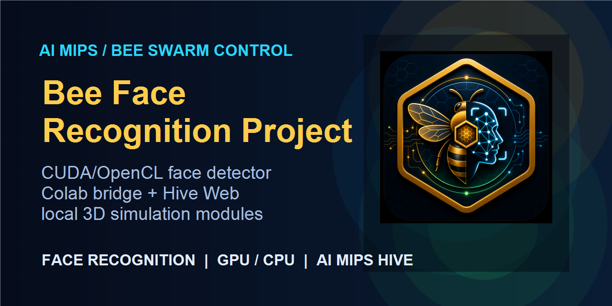
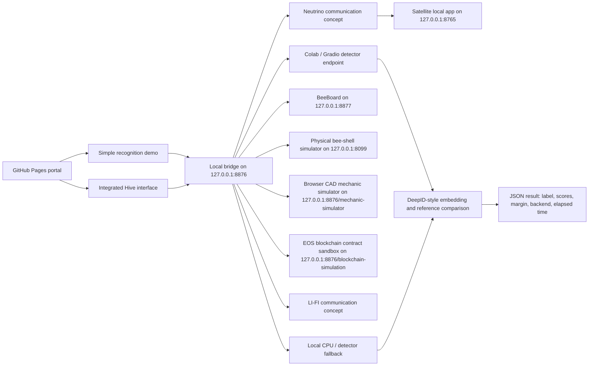

# Bee Face Recognition Project



AI-assisted full-stack prototype that connects a face-recognition detector with a browser-based AI MIPS / bee-swarm interface, a Colab CUDA runtime, local CPU/OpenCL-style execution paths, and local 3D / physical simulation tools.

The project is built as a portfolio and course-style engineering demo: it is not a polished commercial product, but it is more than a static toy page. It demonstrates how a recognition pipeline, GPU/CPU execution choices, a live web interface, local simulators, installable packages, and a safer browser-to-local-app bridge can be combined into one working system.

## Live Project

- Public GitHub Pages portal:  
  https://holodininyaroslav.github.io/bee-face-recognition-project/
- Colab notebook for the CUDA-backed detector/service:  
  https://colab.research.google.com/github/Holodininyaroslav/bee-face-recognition-project/blob/main/colab/colab_public_one_image_site.ipynb
- Full detector source excerpt shown on the site:  
  https://holodininyaroslav.github.io/bee-face-recognition-project/source/colab_ai_mips_bee_world.py

## What It Does

- Uploads one image or a batch of images for face recognition.
- Lets the user choose GPU or CPU mode from the simple demo interface.
- Uses the same detector output format in the simple demo and in the integrated Hive interface.
- Shows a step-by-step explanation of the neural recognition pipeline.
- Shows CUDA-oriented notes and code annotations for the computation stages.
- Hosts an integrated AI MIPS Hive-style interface with processors, detections, bus/matrix/control events, and bee-node UI.
- Provides local installers for related simulations:
  - AI MIPS Hive Service local menu and backend package.
  - Ursina 3D game/simulation package.
  - BeeBoard interface package.
  - Physical bee-shell / FWMAV simulation package.
  - Browser CAD/mechanic simulation inside the AI MIPS Hive Service package.
  - EOS blockchain contract sandbox inside the AI MIPS Hive Service package.
  - LI-FI communication concept branch inside the Network simulator menu.
  - Neutrino communication concept branch with Basic concept and Satellite comunication nodes.
- Uses a token-gated local bridge so the public site does not automatically control applications on the local computer.

## High-Level Architecture



## Distributed Bee Datacenter Concept

The larger project idea treats the bee swarm as a distributed micro-datacenter. In this model, each bee is not only a visual object in the interface, but a small AI MIPS compute node with local state, messaging, control flow, and a limited compute budget.

The face-recognition task is used as a practical workload for this swarm concept:

- each bee can represent one AI MIPS processor/node;
- the Hive interface shows node roles, links, bus events, detections, and processor state;
- detector results can be routed back into the same Hive UI that represents the swarm;
- the swarm is intended to model how many small compute agents could cooperate on a larger recognition workload.

For the full conceptual face-recognition workload, the target scale is a swarm of about **1200 bees / AI MIPS nodes**. In the current repository this is presented as a project architecture target and simulation concept, not as a claim that the published GitHub Pages demo already runs 1200 physical or browser nodes at production speed.

## Face Recognition Pipeline

The detector flow is intentionally exposed in the UI so the project can be reviewed as an engineering system, not only as a black-box demo.

1. **Image input**  
   The browser reads the selected image or batch and sends the bytes to the connected detector endpoint.

2. **Face crop and normalization**  
   The detector prepares the useful face region, resizes it to the network input size, and normalizes the numeric image values.

3. **Feature extraction**  
   A DeepID-style neural model converts the face crop into a compact embedding vector.

4. **Reference comparison**  
   The embedding is compared with stored identity reference embeddings.

5. **Score and margin decision**  
   The best label is accepted only when the score is high enough and the margin from the runner-up is large enough. Otherwise the result can be rejected instead of forcing a wrong identity.

6. **JSON response**  
   The service returns a readable summary and structured JSON containing the selected label, scores, margin, backend mode, elapsed time, and acceptance status.

## GPU / CPU Execution

The Colab path is designed to use CUDA acceleration through PyTorch when a CUDA runtime is available. CPU mode runs the same recognition logic without CUDA. The demo exposes both modes so the behavior and timing can be compared.

The project also includes local GPU/CPU integration work around the AI MIPS interface and local detector flow. The public README describes the current published demo and Colab-facing source; some local runtime pieces are distributed through installers or kept as local application code.

## Local Bridge Security

The public GitHub Pages site does **not** connect to local applications by default.

Browser-to-local-app access requires:

- the local service to listen only on `127.0.0.1`;
- a long private `local_token`;
- `local_bridge=1` in the page URL;
- a per-action allowlist such as `detect_face`, `control_hive`, `open_beeboard`, `open_physical`, or `start_ursina`;
- trusted browser Origin checks.

The site also removes `local_token` from the visible address bar after an approved load and sets `referrer=no-referrer`.
The browser-to-local bridge is intentionally session based: after a long idle period the page pauses local access and asks for explicit confirmation before reconnecting, instead of silently keeping local apps open forever.

Detailed bridge security notes:  
https://github.com/Holodininyaroslav/bee-face-recognition-project/blob/main/SECURITY_LOCAL_BRIDGE.md

## Future Roadmap

Future releases are planned to add additional abstraction layers around the current detector, Hive interface, and bee-swarm simulation:

- **Flight mechanics map** - a near-term simulation map for bee flight mechanics, including a more detailed mechanical description of the body, wings, actuator loads, and motion model.
- **Nano-capacitor energy layer** - an advanced simulation layer for nano-capacitors that accumulate electrical energy for the bee's operation.
- **Distributed bee datacenter mode** - a swarm-level simulation where many bees operate as a distributed datacenter. In this mode, a distributed neural network runs across many **AI MIPS processors**, using the AI MIPS processors that already exist inside each bee.
- **Li-Fi swarm networking** - communication modules that show how nearby bees connect into a unified compute network through Li-Fi links.
- **Bioreactor energy stage** - a long-term simulation stage where a bioreactor processes plastic and generates electrical energy. This is the furthest planned stage of the project, but it is part of the intended release direction.

## Installer

The recommended installation path is one full local suite package:

https://github.com/Holodininyaroslav/bee-face-recognition-project/releases/latest/download/bee_face_full_local_suite_installer.zip

This package installs the local Hive service, the integrated Hive menu, BeeBoard 3D review with model assets, Bgame, physical wing calibration, browser CAD/mechanic simulation, satellite/orbital mechanics, blockchain/communication concept pages, and the launch scripts used by the browser menu.

The release still keeps several individual component archives as legacy/internal recovery assets, but the normal user flow should use the full local suite installer so the tools and models stay in sync.

The Colab detector payload remains available separately for notebook/runtime setup:

https://github.com/Holodininyaroslav/bee-face-recognition-project/releases/latest/download/colab_ai_mips_bee_identity_payload_compact.zip

The AI MIPS Hive Service installer now includes the integrated Hive menu, the browser CAD/mechanic animation page, and the EOS blockchain simulation page:

```text
AI_MIPS_Hive_Service/python_ai_mips_sim/web/mechanic-simulator.html
http://127.0.0.1:8876/mechanic-simulator
AI_MIPS_Hive_Service/python_ai_mips_sim/web/blockchain-simulation.html
http://127.0.0.1:8876/blockchain-simulation
```

In the Hive map, expand the `Physical simulator` hex to open the additional `Mechanic Simulation` hex. That page renders the CAD-style wing/body mechanism in the browser and reads live simulator state when the physical simulator is running, with a procedural fallback when it is not.
The mechanic simulation is packaged with its own browser CAD assets:

```text
AI_MIPS_Hive_Service/python_ai_mips_sim/web/cad-mechanics/app.js
AI_MIPS_Hive_Service/python_ai_mips_sim/web/cad-mechanics/bee-shell.obj
AI_MIPS_Hive_Service/python_ai_mips_sim/web/vendor/three-addons/controls/OrbitControls.js
AI_MIPS_Hive_Service/python_ai_mips_sim/web/vendor/three-addons/loaders/OBJLoader.js
```

These files let a fresh local Hive installation open the Browser CAD Mechanics simulator without depending on the original development server at `127.0.0.1:8877/cad-mechanics`.

In the Hive map, expand the blue `Network simulator` hex to open the blue `Blockchain Simulation` hex. That page is a local EOS-style sandbox: it shows a simulated 2000.0000 EOS treasury, node registry, job/result ledger, installer hash registry, contract source, and line-by-line contract annotations. It does not send transactions to a real EOS/Vaulta blockchain.

The same Network branch also contains communication research nodes:

- `LI-FI comunication` - a blue concept node reserved for local optical swarm-network simulations.
- `neutrino comunication` - a purple concept node for long-range communication ideas.
- `Basic concept` - a purple concept explanation node under `neutrino comunication`.
- `Satellite comunication` - a purple node that opens the local satellite communication application at `http://127.0.0.1:8765/`.

The satellite simulator is packaged separately as `satellite_communication_installer.zip`. It contains the local Earth-orbit WebGL app, satellite GLB models, Three.js loader files, and a launcher that starts `http://127.0.0.1:8765/`.

The LI-FI, neutrino, and blockchain communication systems are concept/sandbox modules in the current release. They are included so the project architecture can be reviewed and expanded, but they are not production communication networks and they do not connect to real satellite, neutrino, or live EOS infrastructure.

The BeeBoard package includes the local BeeBoard interface and the 3D Board Review assets, including:

```text
BeeBoard_Interface/
BeeBoard_v0_1_Micro_KiCad/BeeBoard_v0_1_Micro.glb
BeeBoard_v0_1_Micro_KiCad/BeeBoard_v0_1_Micro_board_layers.step
BeeBoard_v0_1_Micro_KiCad/BeeBoard_v0_1_Micro_KiCad.kicad_pcb
```

After installation, BeeBoard should report `model_exists: true` from `http://127.0.0.1:8877/api/health`.

The physical simulator package is the current local version tied to:

```text
http://127.0.0.1:8099/?fresh=bee-shell-rotated
```

It contains the Flappy/FWMAV inspector-based simulator with visible bee-shell outline and live mechanics state, not the older simple canvas placeholder.

For a clean setup on another Windows computer, see:

```text
CODEX_OTHER_PC_INSTALL.md
```

## Repository Layout

```text
/
|-- index.html                         # GitHub Pages portal
|-- script.js                          # UI logic, translations, simple demo, local bridge hooks
|-- styles.css                         # Bee/Hive visual design
|-- source/
|   `-- colab_ai_mips_bee_world.py      # Published detector/Hive source excerpt
|-- colab/
|   `-- colab_public_one_image_site.ipynb
|-- backup/                            # Reserved backup/static placeholder area
|-- installers/
|   `-- README.md                       # Installer download notes
|-- CODEX_OTHER_PC_INSTALL.md           # Fresh-computer installation guide
|-- SECURITY_LOCAL_BRIDGE.md            # Local bridge safety notes
`-- physical_simulation_installer.zip   # Current physical bee-shell simulator package
```

## What This Project Demonstrates

- AI-assisted development of a multi-part prototype.
- Web UI design and multilingual interface text.
- Image upload, batch handling, and detector JSON integration.
- GPU/CPU mode selection and timing comparison.
- CUDA-runtime use through Colab/PyTorch.
- Local simulation integration through browser-accessible tools.
- Token-gated localhost bridge design.
- Packaging of local tools as downloadable installers.
- Clear explanation of neural-network stages for review and presentation.

## Current Limitations

- This is a prototype/research demo, not a hardened production service.
- The public GitHub Pages site is static; live recognition requires an approved local bridge or a running Colab/Gradio detector service.
- Local simulation tools depend on the user's environment, installed runtime, and local ports.
- Recognition quality depends on the reference images, thresholds, face crop quality, and runtime configuration.
- Some local application code is distributed as installers rather than fully expanded in this Pages repository.

## AI-Assisted Development Note

This project was built with AI-assisted development. The engineering work focused on system design, integration, iteration, testing, UI structure, detector workflow, deployment packaging, and safety controls. The use of AI assistance is treated as part of the development process, not as a claim that every line was handwritten manually.

## Suggested Resume Description

**Bee Face Recognition Project** - AI-assisted full-stack prototype integrating a face-recognition detector with a Colab CUDA backend, CPU/GPU mode selection, a browser-based AI MIPS Hive interface, local 3D/physical simulation tools, installable local packages, and a token-gated localhost bridge for safer browser-to-local-app communication.
